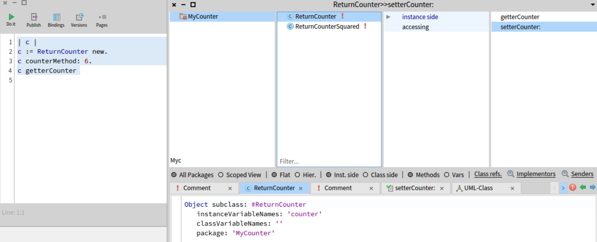
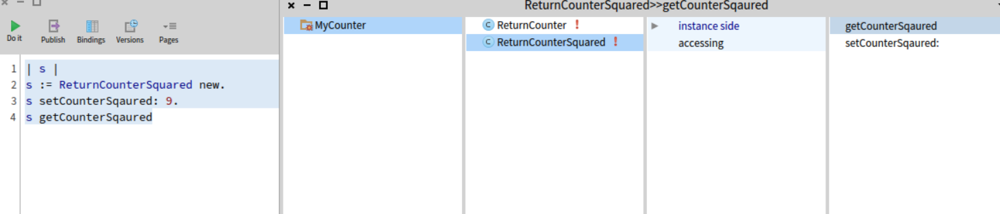
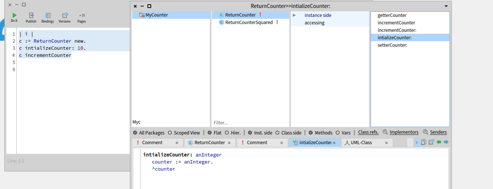
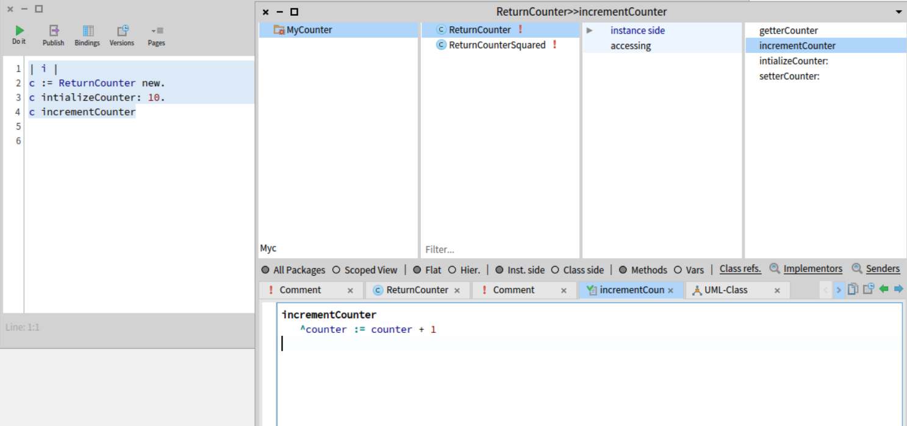
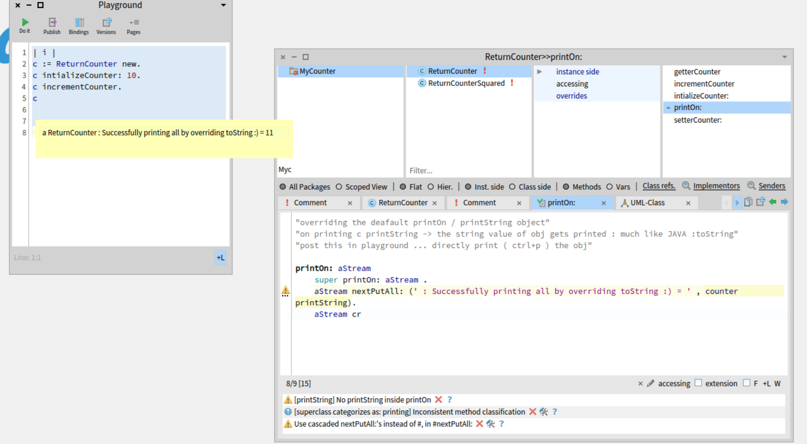

## class , instance obj , methods
=====================================================

- everything inside image 2

"W1 REDO1"

```smalltalk
"make a new package -> go to system browserand create new package" 
"below is class definition" 
"instance variable == unique variable for each object"
"class variable == shared variable for all object of the class"
"package == where it is located"

Object subclass: #ReturnCounter
	instanceVariableNames: 'counter'
	classVariableNames: ''
	package: 'MyCounter'
```

```smalltalk
"ctrl+S"
"return type of class in accesing part : 3rd col"
"counter: anInteger → This defines an instance method named counter: that takes one argument (anInteger)."

counter: anInteger
  counter := anInteger
  ^counter
```

'second type'

```smalltalk
Object subclass: #ReturnCounterSquared
	instanceVariableNames: 'counter'
	classVariableNames: ''
	package: 'MyCounter'

counter: anInteger
^counter squared
```

images : 


```smalltalk
"setter counter function : " 

setterCounter: anInteger
  counter := anInteger. "the instance variable we just defined"

"getter counter funciton"

getterCounter
  ^counter     "return the counter object"
```
----------------------------------------------------------
"example 2 : sqauring"


"getter method :"

```smalltalk
getCounterSqaured
^counter


"setter method :"
setCounterSqaured: anInteger
counter := anInteger.
counter := counter squared.	
```
------------------------------------------

"exmaple 3 : initialize + increment"




-------------------------------------

"TO WRITE TEST CASES + CLASS METHODS SEE W1: REDO5"

----------------------

"overriding toString method "
