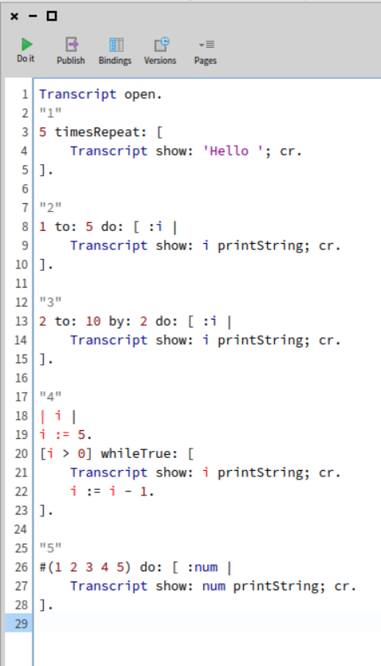
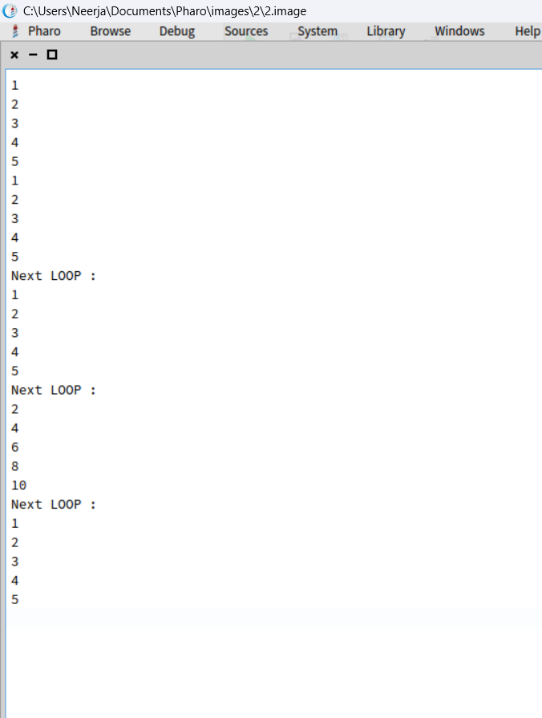
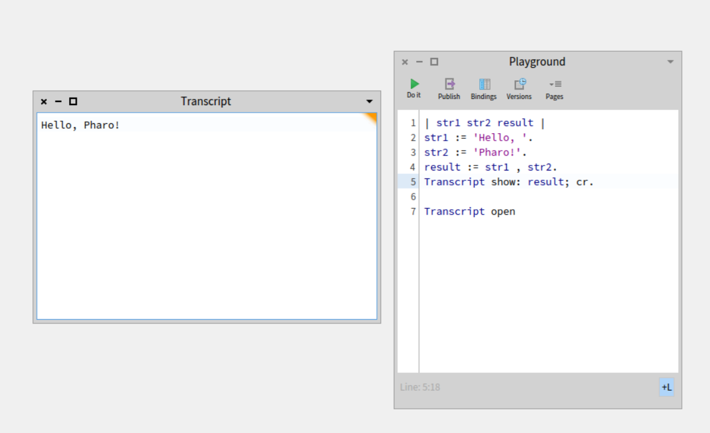
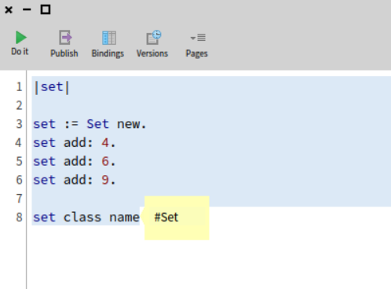

"W2 Phro lec"

----------------------------

"loops"




---------------------------
"UNDERSTANDING ASSIGNMENT"

"Eg1"

"using variables and string concat"

```smalltalk
| str1 str2 result |
str1 := 'Hello, '.
str2 := 'Pharo!'.
result := str1 , str2.
Transcript show: result; cr.  

Transcript open
```



----------------------------------------------

"eg2"

```smalltalk
| rect |
rect := 0@0 extent: 100@100.
Transcript show: rect printString; cr.
```

--------------------------------------

"eg3"

"the below makes a pair"

```smalltalk
|i|
i := 5 -> 10.
"i class  == Association"

i key.   "prints key"
i value.  "prints value"
```
--------------------------------------------------------------

"cascade + separator"

. = separator
; = cascade

```smalltalk
Transcript cr.
Transcript show: 1.
Transcript cr.
Transcript show: 2.
Transcript cr.
Transcript show: 3.
```

"is equal to"

```smalltalk
Transcript 
    cr;
    1;
    cr;
    2;
    cr;
    3;
```
----------------------------------

"eg4"

