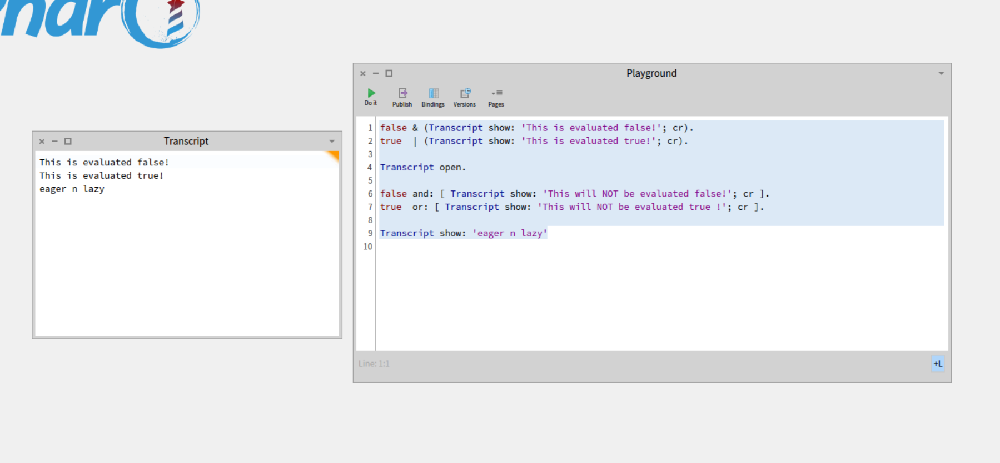

& , | == eager ( evaluate all )

"Eager Operators (Strict Evaluation)"
"Eager operators evaluate all expressions immediately, regardless of necessity."

```smalltalk
false & (Transcript show: 'This is evaluated!'; cr).  "Still evaluates!"
true  | (Transcript show: 'This is evaluated!'; cr).  "Still evaluates!"
```

Explanation
Even though false & ... should be false, the right-hand side still executes.
This can be inefficient if the right-hand side is complex or causes errors.

-------------------------------------------

and:  , or: (lazy evaluation) noen of the below evaluate

```smalltalk
false and: [ Transcript show: 'This will NOT be evaluated!'; cr ].
true  or: [ Transcript show: 'This will NOT be evaluated!'; cr ].
```



------------------------------------------------