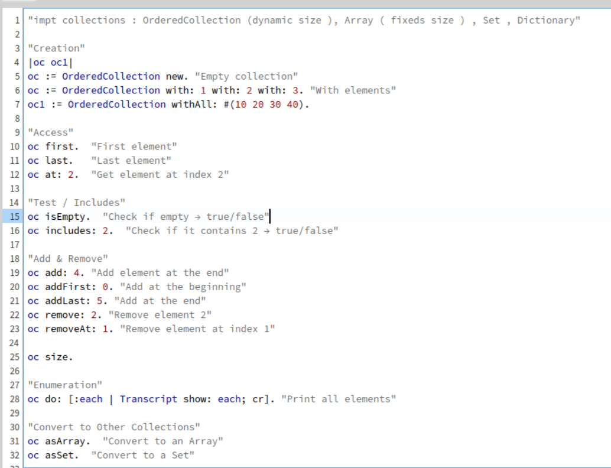
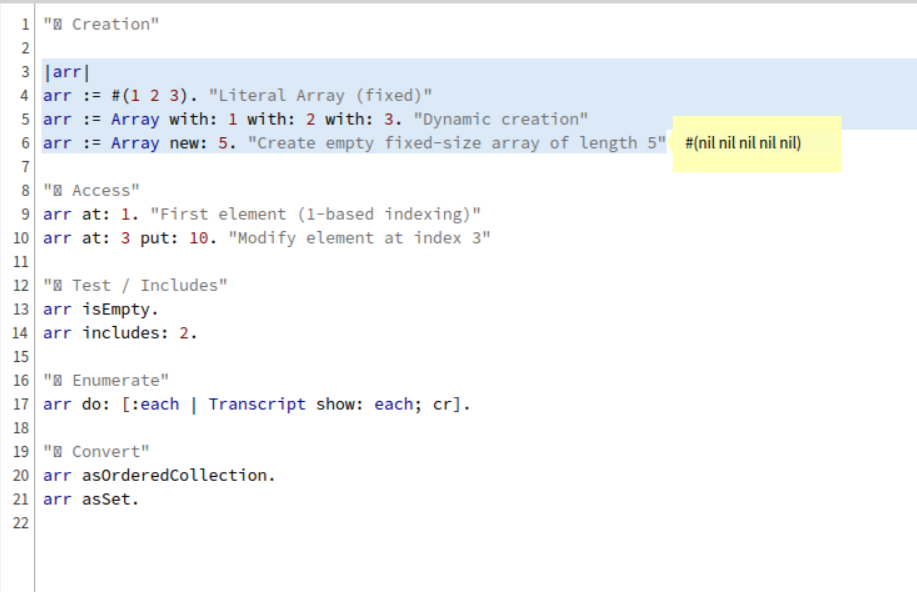
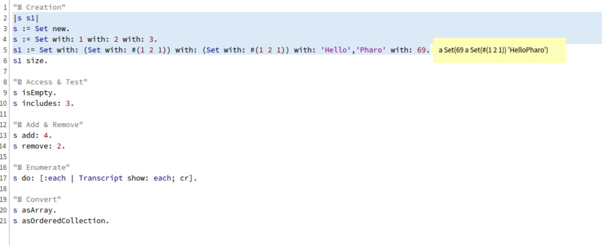
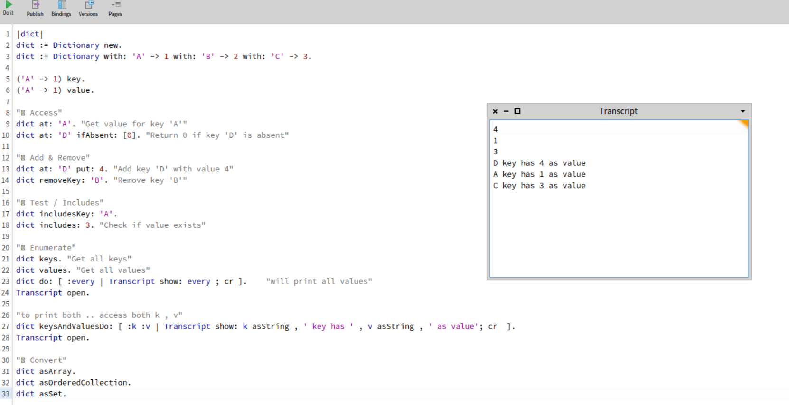

1) Ordered Collecion



--------------------------------------------

2) Arrays ( literal arrays)



----------------------------------------------

3) Set

always removes dups 
therfore in line no. 5 : 

```smalltalk
s1 := Set with: (Set with: #(1 2 1)) with: (Set with: #(1 2 1)) with: 'Hello','Pharo' with: 69.

"(Set with: #(1 2 1)) was only added once"
```



-----------------------------------------------------------

4) Dictionary

