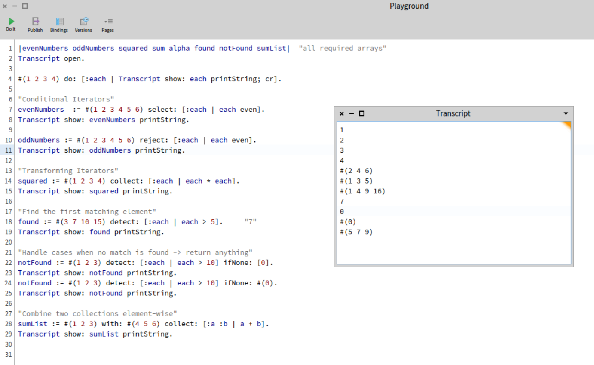
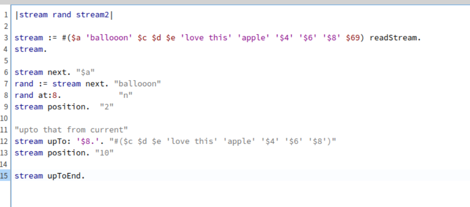
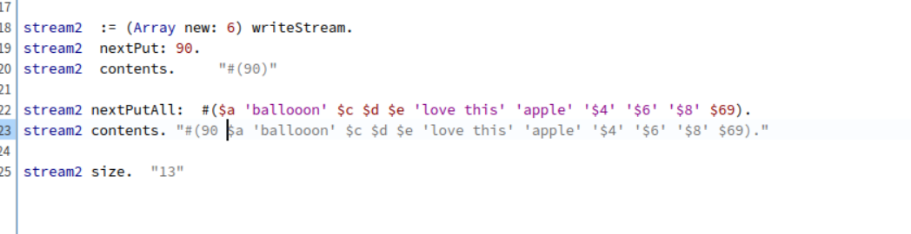

some common iterators : 

--------------------------------------------
"stream reading"

----------------------------------

"stream writing"

PS. u can also write in a file whocih is not created yet ( using asFileReference writeStream)