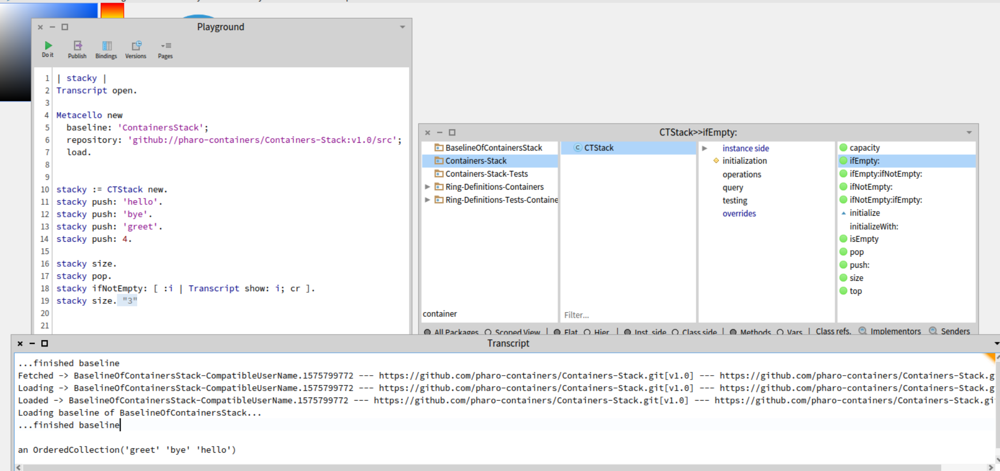

"using external packages in your own sys"
"we imported Container-Stack n Container-Stack-Test in our image"




```smalltalk
| stacky |
Transcript open.

Metacello new
  baseline: 'ContainersStack';
  repository: 'github://pharo-containers/Containers-Stack:v1.0/src';
  load.


stacky := CTStack new.
stacky push: 'hello'.
stacky push: 'bye'.
stacky push: 'greet'.
stacky push: 4.

stacky size.
stacky pop.
stacky ifNotEmpty: [ :i | Transcript show: i; cr ].
stacky size. "3"
```