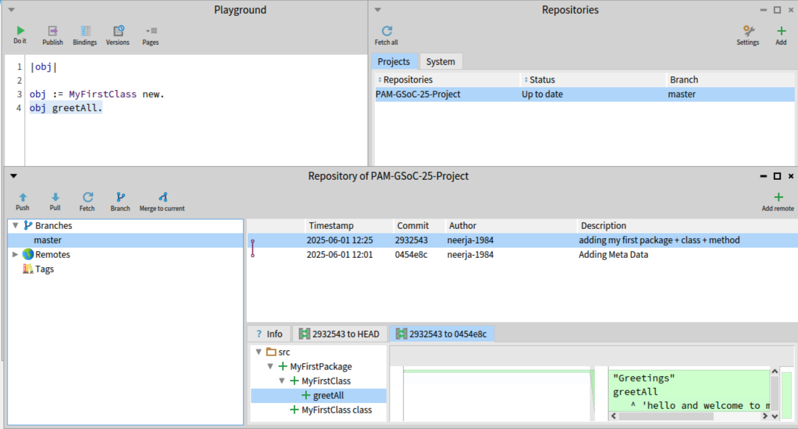

1) Iceberg is a version control system for Pharo.

- the below is a image showing the repository structure added to github via Iceberg 



- connect via ssh keys to github (username + password ) system dosent work 

- steps .. run the following in GitBash Terminal:

```bash
# generate keys ( RSA dosent work anymore)
ssh-keygen -t ed25519 -C "your_email@example.com"

# enable your ssh agent
eval "$(ssh-agent -s)"
ssh-add ~/.ssh/pharo_key

# copy and paste the below public key to GITHUB ssh keys 
cat ~/.ssh/pharo_key.pub

```

-  set your credentials in pharo to use this private and public key 


- when pushing -> use the ssh url as your remote :

`git@github.com:yourusername/your-repo.git`

- doneeee !!!

- tutorials that helped : 
    - [YT link from Discord group](https://youtu.be/K70fiNJvPCY)
    - [YT link from mooc courses](https://www.youtube.com/watch?v=k5KlIzAeqfA&list=PL2okA_2qDJ-kCHVcNXdO5wsUZJCY31zwf&index=59)