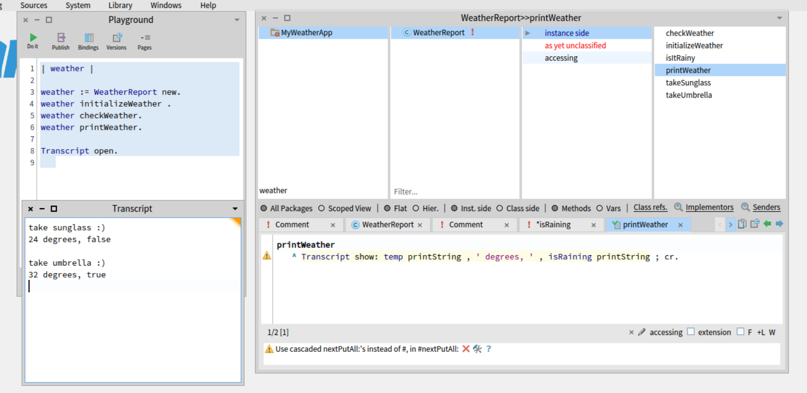

"Weather app"


---------------

```smalltalk
"Method calls :"

checkWeather 
	^ self isItRainy 
		ifTrue: [ self takeUmbrella]
		ifFalse: [ self takeSunglass  ].

initializeWeather 
	isRaining := #(true false) atRandom.
	temp := (23 to: 48) atRandom.

isItRainy 
	^ isRaining.

takeSunglass
	^ Transcript show: 'take sunglass :)'

takeUmbrella
	^ Transcript show: 'take umbrella :)'

printWeather
	^ Transcript show: temp printString , ' degrees, ' , isRaining printString ; cr.
```
-----------------------

```smalltalk
"Playground input :"

| weather |

weather := WeatherReport new.
weather initializeWeather .
weather checkWeather.
weather printWeather.
	
Transcript open.
```
-----------------------------
